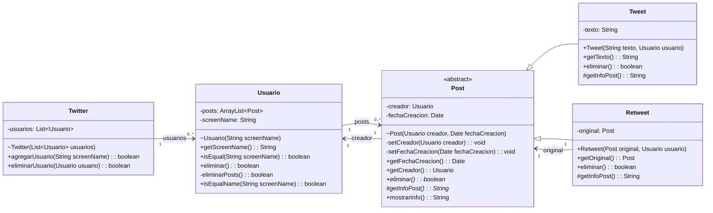

# TWITTER

```mermaid
classDiagram
    direction LR
    class Twitter {
        -usuarios: List~Usuario~
        ~Twitter(List~Usuario~ usuarios)
        +agregarUsuario(String screenName): boolean
        +eliminarUsuario(Usuario usuario): boolean
    }

    class Usuario {
        -posts: ArrayList~Post~
        -screenName: String
        ~Usuario(String screenName)
        +getScreenName(): String
        +isEqual(String screenName): boolean
        +eliminar(): boolean
        -eliminarPosts(): boolean
        +isEqualName(String screenName): boolean
    }

    class Post {
        <<abstract>>
        -creador: Usuario
        -fechaCreacion: Date
        ~Post(Usuario creador, Date fechaCreacion)
        -setCreador(Usuario creador): void
        -setFechaCreacion(Date fechaCreacion): void
        +getFechaCreacion(): Date
        +getCreador(): Usuario
        +eliminar(): boolean*
        #getInfoPost(): String*
        +mostrarInfo(): String
    }

    class Tweet {
        -texto: String
        +Tweet(String texto, Usuario usuario)
        +getTexto(): String
        +eliminar(): boolean
        #getInfoPost(): String
    }

    class Retweet {
        -original: Post
        +Retweet(Post original, Usuario usuario)
        +getOriginal(): Post
        +eliminar(): boolean
        #getInfoPost(): String
    }

    Twitter "1" --> "0..*" Usuario : usuarios
    Usuario "1" --> "0..*" Post : posts
    Post "1" --> "1" Usuario : creador
    Post <|-- Tweet
    Post <|-- Retweet
    Retweet "1" --> "1" Post : original
   
```